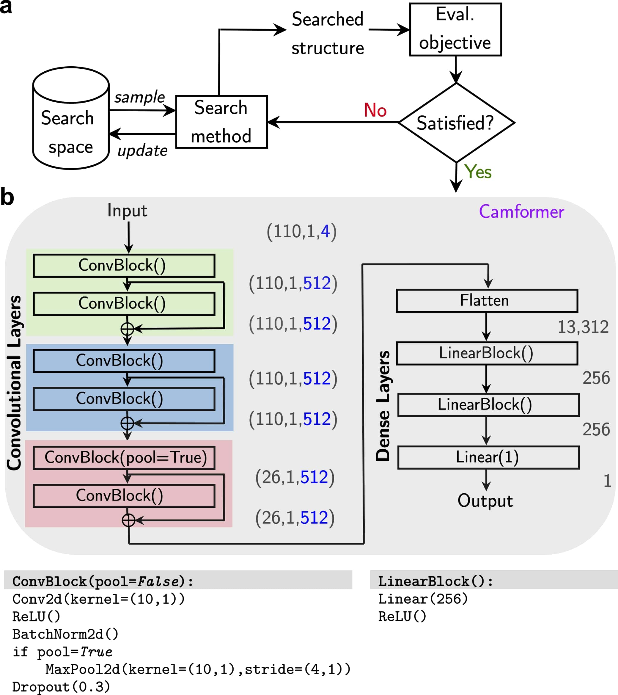
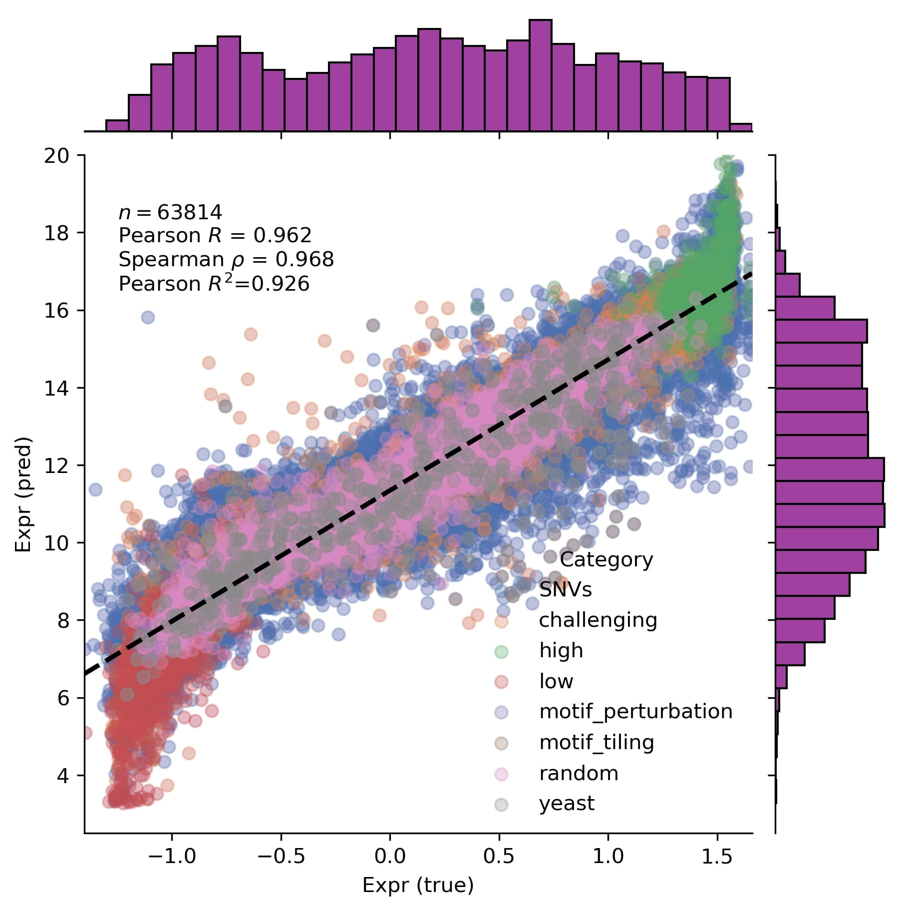
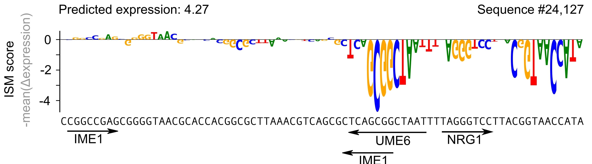

### Camformer
Predicting gene expression using millions of yeast promoters reveals *cis*-regulatory logic

**Problem**: Let $S = \{A,C,G,T,N\}^{110}$ denote a promoter sequence of length $110$. Here, $A$, $C$, $G$, $T$ are the four nucleotides and  $N$ represents an unknown nucleotide.  The gene expression prediction task is then to learn a mapping  $f: S \to \mathbb{R}$.

    

**Data**: We use data from [DREAM Challenge](https://zenodo.org/records/7395397) consisting of 7 million random promoter sequences and the yellow fluorescent protein level. We then use the official test set from the challenge to evaluate our trained model(s).

**Model**: A residual convolutional neural network, strategically optimised using automated hyperparameter tuning.

    

The figure above shows the structure of the original (large variant) model (16M parameters). There is an almost equally good model that has 90\% less parameters (1.4M). Please see the associated manuscript (preprint) for more details. 

**Assessment**: Predictive

    

**Assessment**: Explanatory, Scientific discovery

    

#### File information

Here are some details on what the purpose of each file is:

| File               | Purpose                                                                       |
|:-------------------| :-----------------------------------------------------------------------------|
| `gen_figs.ipynb`   | A notebook to show (re-generate) some figures in the manuscript.              |
| `train_rep.py`     | Program to train several replicates of a Camformer model using training data. |
| `score_rep.py`     | Program to test several replicates of a trained Camformer model on test data. |

#### Directory structure

To be updated.

#### References

Relevant resources and previous Camformer repositories.

0. Camformer repository (full): [Complete repo](https://github.com/tirtharajdash/Camformer)
1. Camformer repository (2022 version): [DREAM2022 Submission](https://github.com/FredrikSvenssonUK/DREAM2022_Camformers)
2. Camformer repository (Pre-submission): [Camformer (old)](https://github.com/FredrikSvenssonUK/camformers)
3. DREAM 2022 Challenge [Wiki Page](https://www.synapse.org/#!Synapse:syn28469146/wiki/617075)
4. Rafi et al., 2023: [Paper](https://www.biorxiv.org/content/10.1101/2023.04.26.538471v1)
5. Rafi et al., 2023: [Official Evaluation](https://zenodo.org/records/7395397)

