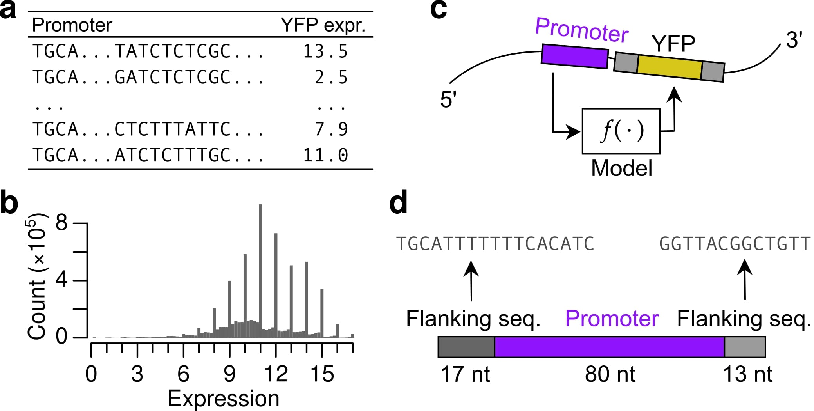

### Camformer
Predicting gene expression using millions of yeast promoters reveals *cis*-regulatory logic

**Problem**: Let $S = \{A,C,G,T,N\}^{110}$ denote a promoter sequence of length $110$. Here, $A$, $C$, $G$, $T$ are the four nucleotides and  $N$ represents an unknown nucleotide.  The gene expression prediction task is then to learn a mapping  $f: S \to \mathbb{R}$.

    

**Data**: We use data from [DREAM Challenge](https://www.synapse.org/#!Synapse:syn28469146/wiki/617075) consisting of 7 million random promoter sequences and the yellow fluorescent protein level.

**Model**: A residual convolutional neural network.

    

**Assessment**: Predictive and Explanatory

#### File information

Here are some details on what the purpose of each file is:

| File               | Purpose                                                                |
|:-------------------| :----------------------------------------------------------------------|
| `gen_figs.ipynb`   | A notebook to show (re-generate) some figures in the manuscript.       |

#### Directory structure

To be updated.

#### References

Relevant resources and previous Camformer repositories.

1. Camformer repository (2022 version): [DREAM2022 Submission](https://github.com/FredrikSvenssonUK/DREAM2022_Camformers)
2. Camformer repository (Pre-submission): [Camformer (old)](https://github.com/FredrikSvenssonUK/camformers)
3. DREAM 2022 Challenge [Wiki Page](https://www.synapse.org/#!Synapse:syn28469146/wiki/617075)
4. Rafi et al., 2023: [Paper](https://www.biorxiv.org/content/10.1101/2023.04.26.538471v1)
5. Rafi et al., 2023: [Official Evaluation](https://zenodo.org/records/7395397)

